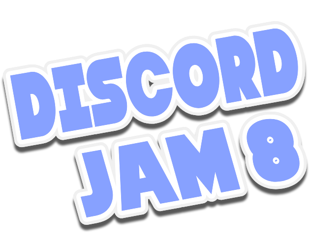

# (DJAM 8 - Orbital Decay)[https://zafteer.itch.io/djam8-orbital-decay]



Theme: Decay

[DJAM8](https://itch.io/jam/discord-jam-8) - [Discord](https://discord.gg/uTaQTzTtBF)

Team members:

- [HotNoggin](https://github.com/HotNoggin)
- [TheNetherPug](https://github.com/TheNetherPug)
- [ZAFT](https://github.com/zaftnotameni)

Built Using:

- [Godot 4.3-rc3](https://github.com/godotengine/godot-builds/releases/download/4.3-rc3/Godot_v4.3-rc3_win64.exe.zip)
- [neovim](https://neovim.io/)
- [butler](https://itch.io/docs/butler/pushing.html)

Jam Rules:

- Make a game in 48 hours around the theme
- You’re free to use any tools or libraries to create your game
- Basecode is allowed
- You are allowed to used premade assets (including third-party assets you have the right to use)
- You can work Solo or in a Team. There is no limit to the amount of members you can have in a team.

## Game

- [x] Orbit is decaying, player must fix the ship to keep it going
- [x] Movement inside ship is left-right only
- [x] Movement outside ship is 4-way jetpack
- [x] Interactible "devices" inside become defective from time to time
- [x] Interactible "hull" outside become defective from time to time
- [x] Player moves near a defect (inside) and interacts to fix
- [x] Player moves near a defect (outside) and interacts to fix
- [x] Onboard display shows current stats about the orbit
- [x] HUD indicating current orbit radius and how far we are from escaping
- [x] Defective devices cause orbit decay
- [x] Functioning devices cause orbit ascent
- [x] Victory Screen
- [x] Defeat Screen

## Adding Audio

Put audio files in one of these folders:

- `res://assets/audio/Master`: basically shouldn't be used, only used for the test sound
- `res://assets/audio/BGM`: music
- `res://assets/audio/SFX`: sound effects
- `res://assets/audio/UI`: UI interactions (button clicks, focus/hover, etc)

**Important**: Open the audio scene (`res://game/autoload/audio.tscn`) and save.
That will update the `NamedAudio` enum based on the files in those folders automatically.

To play audio from anywhere use the `play_named_...` functions:

- `Audio.play_named_ui(NamedAudio.UI.UI_ButtonClick)`
- `Audio.play_named_bgm(NamedAudio.BGM.BGM_BackgroundMusicName)`
- `Audio.play_named_sfx(NamedAudio.SFX.SFX_Boom)`

## Running the Project

If you are on windows and have the correct Godot version with the default name in a folder on your path, you can just run:

```ps
bat\editor-rc.bat
```

That line will automatically start Godot 4.3-rc3 in verbose mode, skipping the project selection screen.

## Deploying the project

The project should be exported to (those folders already have a `.gdignore` so the editor won't load them):

- `res://exports/web`: web version
- `res://exports/win`: windows version
- `res://exports/lin`: linux version

After exporting, the following commands (assuming you have butler setup) will deploy each version:

- `bat\itch-web.bat`: web version
- `bat\itch-win.bat`: windows version
- `bat\itch-lin.bat`: linux version
